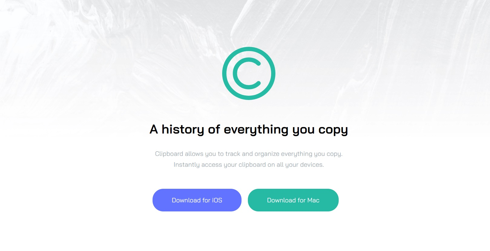

# Frontend Mentor - Clipboard landing page solution

This is a solution to the [Clipboard landing page challenge on Frontend Mentor](https://www.frontendmentor.io/challenges/clipboard-landing-page-5cc9bccd6c4c91111378ecb9). Frontend Mentor challenges help you improve your coding skills by building realistic projects.

## Table of contents

- [Overview](#overview)
  - [The challenge](#the-challenge)
  - [Screenshot](#screenshot)
  - [Links](#links)
- [My process](#my-process)
  - [Built with](#built-with)
  - [What I learned](#what-i-learned)
  - [Useful resources](#useful-resources)
- [Author](#author)
- [Acknowledgments](#acknowledgments)

## Overview

### The challenge

My task was to create a responsive landing page

### Screenshot

### Links

- Live Site URL: [https://clipboard-lp-bay.vercel.app/](https://clipboard-lp-bay.vercel.app/)

### Built with

- JSX Markup
- CSS custom properties
- Flexbox
- CSS Grid
- Mobile-first workflow
- [React](https://reactjs.org/) - JS library
- [React Icons](https://react-icons.github.io/react-icons/) - Icon library
- [AOS](https://michalsnik.github.io/aos/) - Animation library

### What I learned

While working on a React project, I wanted to incorporate animations using a popular animation library. However, I wasn't sure how to apply the library's animations using the useEffect hook. To learn this, I followed a step-by-step guide from the documentation and gained a deeper understanding of the process.

## Author

- Frontend Mentor - [@quenyoni](https://www.frontendmentor.io/profile/quenyoni)
- Twitter - [@quenyoni](https://www.twitter.com/quenyoni)

## Acknowledgments

I would like to thank FEM for giving out free challenges like this to help me hone my skills as a frontend developer.
